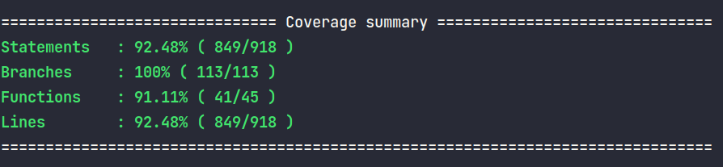

[![Contributors][contributors-shield]][contributors-url]
[![Forks][forks-shield]][forks-url]
[![Stargazers][stars-shield]][stars-url]
[![Issues][issues-shield]][issues-url]

<!-- PROJECT LOGO -->

<br />
<p align="center">

  

  <h3 align="center">Car Rent API</h3>

  <p align="center">
   API for a car rent store (In development).
    <br />
    <a href="https://github.com/Torres-ssf/rent-car-api/issues">Report Bug</a>
    ·
    <a href="https://github.com/Torres-ssf/rent-car-api/issues">Request Feature</a>
  </p>
</p>

<!-- ABOUT THE PROJECT -->

## About The Project

This project is a RESTful API for a car rent store. The application it's still in development stage. The implemented features are:

- Users can create new account.
- Users can create a new session using their credentials.
- Users can create/update their avatar image.
- Users with admin privileges can create a new Category (each car should belongs to a category).
- Users with admin privileges can create a new Specification (each car can have multiple specifications).
- Users with admin privileges can add new cars.
- Users with admin privileges can add multiple images to each car.
- Users with admin privileges can add multiple specifications to each car.
- Users can see a list of all available cars and filter them by model, brand, and category.
- Users can rent cars.


### Built With

The project was built using the following languages stacks:

- Node
- Typescript
- [Express](https://www.npmjs.com/package/expresshttps://www.npmjs.com/package/express)
- Docker
- PostgreSQL
- TypeORM
- Tsyringe
- Bcrypt
- Jsonwebtoken
- Class-transformer
- Class-validator
- Multer

<!-- GETTING STARTED -->

## Getting Started

To get a local copy up and running follow these simple example steps.

### Prerequisites

- Node
- NPM
- Yarn

### Installation

1. Clone the repo

```sh
git clone https://github.com/Torres-ssf/rent-car-api
```

2. CD into the project root directory

```sh
cd rent-car-api/
```

3. Install npm packages

```sh
yarn
```

#### Using Docker

This application uses Docker and Docker Compose and can be quickly initiate by simply running `docker-compose up`. In order that to work you will need to have Docker and Docker Compose installed on your system. Docker will setup the database container, create the app and test database, setup the app container, and will start the app. The steps are:

1. Run docker compose.
```
docker-compose up
```

After docker compose finishing initiate the application, you will see the log `App launched at 3333 🚀`. Before using the application, it's necessary to run the migrations first.

2. To run the migrations inside the docker container, we can simply use the following script:
```
yarn typeorm:docker migration:run
```

Now the application is ready to be used.

#### Without Docker

Setting up the application without Docker requires more steps.

1. After cloning the repo, make a copy of the `ormconfig.example.json` file and rename it to `ormconfig.json`.

2. We need to edit the properties `user`, `password`, `port`, and `database` at the `ormconfig.json`. The values that you are going to use depends on how postgreSQL is setup on your system. After setting up `user`, `password`, and `port` we need to give the name of an existent database to the `database` property. By default, integration tests run on database called `rent_api_test_db`. We also need to create this database or integration tests are not going work.

3. Now with the database properly setup, we can run the migrations:
```
yarn typeorm migration:run
```

4. And finally, we can start the app:
```
yarn start:dev
```

If everything was done properly, a log message will appear at the terminal: `Server started on port 3333!`

### Usage

It is possible to explore all API endpoints using an interactive documentation created with Swagger UI. After the application is running you can open the browser at `http://localhost:3333/documentation` and start using it.

Many of the endpoints are reserved to admin users. There is a script to easily create an admin. After setting up the Db connection, you can simply run:
```
yarn seed:admin
```

An admin user will be created with the following credentials:
```
email: john.admin@email.com
password: Aa123456
```

To be able to tests login required endpoint at the Swagger Documentation, you will need first to use a jwt token to gain authorization. The steps are the following:

1. At the documentation page, we will use the session endpoint to generate an jwt token. Click at `Try it out`

<p align="center">
  
</p>

2. Give the admin credentials and click on the execute button:

<p align="center">
  
</p>

3. Copy the generated token from the response object:

<p align="center">
  
</p>

4. Click on the `Authorize` button at the top of the page:

<p align="center">
  
</p>

5. Insert the token in the value input and then click on `Authorize`:

<p align="center">
  
</p>


6. Now all endpoints can be used within the documentation.


### Run tests

This application has unit and integrations tests. Integration tests are running in a database named `rent_api_test_db` by default. This database is created by the docker-compose file. If you are not using Docker, it needs to be created manually.

To run the tests we can simply run the following script.

```
yarn test
```

This application is still in development process and unit and integration tests are being written as the application grows, following TDD.

<p align="center">
  
</p>

## Authors

👤 **Torres-ssf**

- Github: [@Torres-ssf](https://github.com/Torres-ssf)
- Twitter: [@torres_ssf](https://twitter.com/torres_ssf)
- Linkedin: [torres-ssf](https://www.linkedin.com/in/torres-ssf/)

## 🤝 Contributing

Contributions, issues and feature requests are welcome!

Feel free to check the [issues page](https://github.com/Torres-ssf/rent-car-api/issues).

## Show your support

Give a ⭐️ if you like this project!

## 📝 License

This project is [MIT](lic.url) licensed.

<!-- MARKDOWN LINKS & IMAGES -->

[contributors-shield]: https://img.shields.io/github/contributors/Torres-ssf/rent-car-api.svg?style=flat-square
[contributors-url]: https://github.com/Torres-ssf/rent-car-api/graphs/contributors
[forks-shield]: https://img.shields.io/github/forks/Torres-ssf/rent-car-api.svg?style=flat-square
[forks-url]: https://github.com/Torres-ssf/rent-car-api/network/members
[stars-shield]: https://img.shields.io/github/stars/Torres-ssf/rent-car-api.svg?style=flat-square
[stars-url]: https://github.com/Torres-ssf/rent-car-api/stargazers
[issues-shield]: https://img.shields.io/github/issues/Torres-ssf/rent-car-api.svg?style=flat-square
[issues-url]: https://github.com/Torres-ssf/rent-car-api/issues
